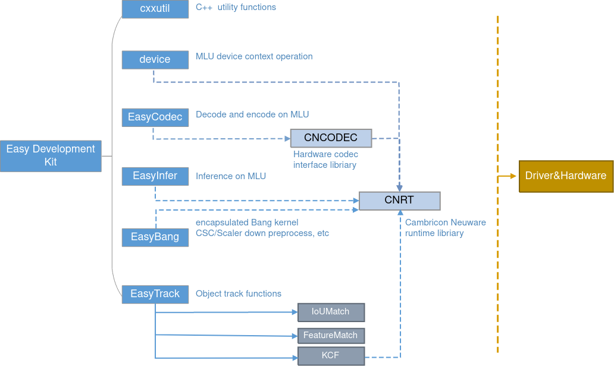

[EN](README.md)|CN

# Cambricon<sup>®</sup> Easy Development Kit

EasyDK(Cambricon<sup>®</sup> Neuware Easy Development Kit)提供了一套面向 
MLU(Machine Learning Unit,寒武纪机器学习单元)设备的高级别的接口（C++11标准），
用于面向MLU平台（MLU270，MLU220）快速开发和部署深度学习应用。

EasyDK共包含如下6个模块:

  - Device: 提供MLU设备上下文及内存等相关操作
  - EasyCodec: 提供支持视频与图片的MLU硬件编解码功能
  - EasyInfer: 提供离线模型推理相关功能
  - EasyBang: 提供简易调用Bang算子的接口，目前支持的算子有ResizeConvertCrop和ResizeYuv
  - EasyTrack: 提供目标追踪的功能
  - cxxutil: 其他模块用到的部分cpp实现



## 快速入门 ##

本节将简单介绍如何从零开始构建EasyDK，并运行示例代码完成简单的深度学习任务。

### 配置要求 ###

寒武纪EasyDK仅支持在寒武纪MLU270和MLU220平台上运行。

#### **构建和运行环境依赖** ####

构建和运行EasyDK有如下依赖：
  - CMake 2.8.7+
  - GCC   4.8.5+
  - GLog  0.3.4
  - Cambricon NEUWARE

测试程序和示例有额外的依赖：
  - OpenCV 2.4.9+
  - GFlags 2.1.2
  - FFmpeg 2.8 3.4 4.2

#### Ubuntu or Debian ####

如果您在使用Ubuntu或Debian，可以运行如下命令安装依赖：

   ```bash
   sudo apt install libgoogle-glog-dev
   # samples dependencies
   sudo apt install libgflags-dev libopencv-dev
   ```

#### CentOS ####

如果您在使用CentOS，可以运行如下命令安装依赖：

   ```bash
   sudo yum install glog
   # samples dependencies
   sudo yum install gflags opencv-devel
   ```

### 编译项目 ###

Easydk仅支持源码编译的方式使用，按如下步骤编译Easydk (`${EASYDK_DIR}` 代表easydk源码目录)：

1. 创建编译文件夹存储编译结果。

   ```bash
   cd ${EASYDK_DIR}
   mkdir build       # Create a directory to save the output.
   ```

2. 运行CMake配置编译选项，并生成编译指令，该命令将会在build目录下生成Makefile文件。

   ```bash
   cd build
   cmake ${EASYDK_DIR}  # Generate native build scripts.
   ```

   Cambricon EasyDK提供了一个CMakeLists.txt描述编译流程，您可以从 http://www.cmake.org/ 免费下载和使用cmake。

   | cmake 选项          | 范围            | 默认值   | 描述                      |
   | ------------------ | --------------- | ------- | ------------------------ |
   | BUILD_SAMPLES      | ON / OFF        | OFF     | 编译samples               |
   | BUILD_TESTS        | ON / OFF        | OFF     | 编译tests                 |
   | RELEASE            | ON / OFF        | ON      | 编译模式release / debug   |
   | WITH_CODEC         | ON / OFF        | ON      | 编译EasyCodec             |
   | WITH_INFER         | ON / OFF        | ON      | 编译EasyInfer             |
   | WITH_TRACKER       | ON / OFF        | ON      | 编译EasyTracker           |
   | WITH_BANG          | ON / OFF        | ON      | 编译EasyBang              |
   | WITH_TURBOJPEG     | ON / OFF        | ON      | 编译turbo-jpeg            |
   | ENABLE_KCF         | ON / OFF        | OFF     | Easytrack支持KCF          |
   | SANITIZE_MEMORY    | ON / OFF        | OFF     | 检查内存                  |
   | SANITIZE_ADDRESS   | ON / OFF        | OFF     | 检查地址                  |
   | SANITIZE_THREAD    | ON / OFF        | OFF     | 检查多线程                 |
   | SANITIZE_UNDEFINED | ON / OFF        | OFF     | 检查未定义行为             |

   示例:

   ```bash
   cd build
   # build with samples and tests
   cmake ${EASYDK_DIR}      \
        -DBUILD_SAMPLES=ON  \
        -DBUILD_TESTS=ON
   ```

3. 运行编译指令。

   ```bash
   make
   ```

   编译后的库文件存放在 `${EASYDK_DIR}/lib` ，头文件在 `${EASYDK_DIR/include}` 


### 开发示例 ###

EasyDK开发示例为用户提供了离线模型，视频文件，运行脚本以及开发示例代码，帮助用户快速体验如何使用EasyDK完成简单的深度学习应用部署。用户可以直接通过脚本运行示例代码，无需修改任何设置。


#### 开发示例目录结构 ####

MLU270 和 MLU220 M.2 平台下，开发示例存放于 `${EASYDK_DIR}/samples/stream-app/` 文件夹下。开发示例包含的文件如下:

  - stream_app.cpp: 示例代码整体流程
  - cnosd.*: 将检测结果绘制在图像上的代码和头文件
  - cnpostproc.*: 网络输出后处理的代码和头文件
  - feature_extractor.*: 提取特征用于Featurematch追踪的代码和头文件
  - run.sh: 运行开发示例时执行的脚本文件
  - CMakelists.txt: CMake文件，编译示例时使用，用户无需做任何设置和改动


#### 编译和运行开发示例 ####

1. 编译样例。编译EasyDK时打开 `BUILD_SAMPLES` 选项即可编译示例代码

2. 运行样例。在stream-app目录下运行如下命令:
   
   ```bash  
   EXPORT LD_LIBRARY_PATH=${LD_LIBRARY_PATH}:${NEUWARE_HOME}/lib64
   ./run.sh MLU270    # MLU270 平台
   # ./run.sh MLU220  # MLU220 M.2 平台
   ```

   运行结束后程序会自动退出。

