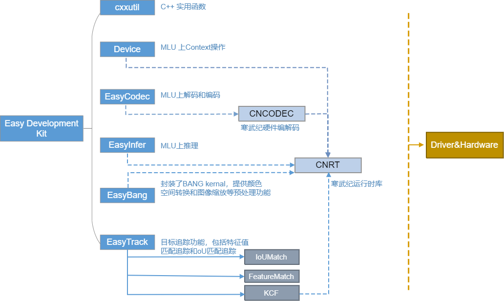
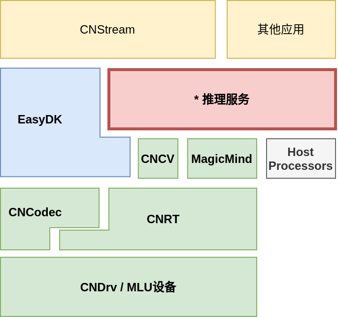

[EN](README.md)|CN

# Cambricon<sup>®</sup> Easy Development Kit

EasyDK(Cambricon<sup>®</sup> Neuware Easy Development Kit)提供了一套面向 
MLU(Machine Learning Unit,寒武纪机器学习单元)设备的高级别的接口（C++11标准），
用于面向MLU平台（MLU270，MLU220，MLU370）快速开发和部署深度学习应用。

EasyDK共包含如下6个模块:

  - Device: 提供MLU设备上下文及内存等相关操作
  - EasyCodec: 提供支持视频与图片的MLU硬件编解码功能
  - EasyInfer: 提供离线模型推理相关功能
  - EasyBang: 提供简易调用Bang算子的接口，目前支持的算子有ResizeConvertCrop和ResizeYuv
  - EasyTrack: 提供目标追踪的功能
  - cxxutil: 其他模块用到的部分cpp实现



EasyDK还包含推理服务组件：提供了一套面向MLU（Machine Learning Unit，寒武纪机器学习单元）类似服务器的推理接口（C++11标准），以及模型加载与管理，推理任务调度等功能，极大地简化了面向MLU平台高性能深度学习应用的开发和部署工作。



推理服务共包含以下3个模块的用户接口:

- Model: 模型加载与管理
- Processor: 可自定义的后端处理单元
- InferServer: 执行推理任务

## 快速入门 ##

本节将简单介绍如何从零开始构建EasyDK，并运行示例代码完成简单的深度学习任务。

### 配置要求 ###

寒武纪EasyDK仅支持在寒武纪MLU270，MLU220和MLU370平台上运行。

#### **构建和运行环境依赖** ####

构建和运行EasyDK有如下依赖：
  - CMake 2.8.7+
  - GCC   4.8.5+
  - GLog  0.3.4
  - Cambricon Neuware Toolkit >= 1.5.0
  - CNCV >= 0.4.0 (optional)
  - libcurl-dev (optional)

使用Magicmind后端有以下额外依赖：

  - Cambricon Neuware Toolkit >= 2.4.2
  - Magicmind >= 0.5.0

（Magicmind运行时库引入对CNNL、CNNL_extra、CNLight的依赖，版本要求见Magicmind用户手册。）

使用Mlu300系列编解码有一下额外依赖：

  - Cambricon Neuware Toolkit >= 2.6.2
  - CNCodec_v3 >= 0.8.2

测试程序和示例有额外的依赖：
  - OpenCV 2.4.9+
  - GFlags 2.1.2
  - FFmpeg 2.8 3.4 4.2

#### Ubuntu or Debian ####

如果您在使用Ubuntu或Debian，可以运行如下命令安装依赖：

   ```bash
   sudo apt install libgoogle-glog-dev cmake
   # optional dependencies
   sudo apt install curl libcurl4-openssl-dev
   # samples dependencies
   sudo apt install libgflags-dev libopencv-dev
   ```

#### CentOS ####

如果您在使用CentOS，可以运行如下命令安装依赖：

   ```bash
   sudo yum install glog.x86_64 cmake3.x86_64
   # optional dependencies
   sudo yum install curl libcurl-devel
   # samples dependencies
   sudo yum install gflags.x86_64 opencv-devel.x86_64 ffmpeg ffmpeg-devel
   ```

### 编译项目 ###

Easydk仅支持源码编译的方式使用，按如下步骤编译Easydk (`${EASYDK_DIR}` 代表easydk源码目录)：

1. 创建编译文件夹存储编译结果。

   ```bash
   cd ${EASYDK_DIR}
   mkdir build       # Create a directory to save the output.
   ```

2. 运行CMake配置编译选项，并生成编译指令，该命令将会在build目录下生成Makefile文件。

   ```bash
   cd build
   cmake ${EASYDK_DIR}  # Generate native build scripts.
   ```

   Cambricon EasyDK提供了一个CMakeLists.txt描述编译流程，您可以从 http://www.cmake.org/ 免费下载和使用cmake。

   | cmake 选项           | 范围            | 默认值  | 描述                                  |
   | ------------------   | --------------- | ------- | ------------------------------------- |
   | BUILD_SAMPLES        | ON / OFF        | OFF     | 编译samples                           |
   | BUILD_TESTS          | ON / OFF        | OFF     | 编译tests                             |
   | WITH_CODEC           | ON / OFF        | ON      | 编译EasyCodec                         |
   | WITH_INFER           | ON / OFF        | ON      | 编译EasyInfer                         |
   | WITH_TRACKER         | ON / OFF        | ON      | 编译EasyTracker                       |
   | WITH_BANG            | ON / OFF        | ON      | 编译EasyBang                          |
   | WITH_BACKWARD        | ON / OFF        | ON      | 编译Backward                          |
   | WITH_TURBOJPEG       | ON / OFF        | OFF     | 编译turbo-jpeg                        |
   | ENABLE_KCF           | ON / OFF        | OFF     | Easytrack支持KCF                      |
   | WITH_INFER_SERVER    | ON / OFF        | ON      | 编译infer-server                      |
   | CNIS_WITH_CONTRIB    | ON / OFF        | ON      | 编译推理服务contrib内容               |
   | CNIS_RECORD_PERF     | ON / OFF        | ON      | 使能推理服务详细性能信息的测量和记录  |
   | CNIS_WITH_CURL       | ON / OFF        | ON      | 使能CURL，支持推理服务从网络下载模型  |
   | CNIS_USE_MAGICMIND   | ON / OFF        | OFF     | 使能推理服务使用Magmicmind作为推理后端|
   | CNIS_WITH_PYTHON_API | ON / OFF        | OFF     | 使能推理服务python接口                |
   | SANITIZE_MEMORY      | ON / OFF        | OFF     | 检查内存                              |
   | SANITIZE_ADDRESS     | ON / OFF        | OFF     | 检查地址                              |
   | SANITIZE_THREAD      | ON / OFF        | OFF     | 检查多线程                            |
   | SANITIZE_UNDEFINED   | ON / OFF        | OFF     | 检查未定义行为                        |

   示例:

   ```bash
   cd build
   # build with samples and tests
   cmake ${EASYDK_DIR}      \
        -DBUILD_SAMPLES=ON  \
        -DBUILD_TESTS=ON
   ```

3. 运行编译指令。

   ```bash
   make
   ```

4. 编译后的库文件存放在 `${EASYDK_DIR}/lib` ；头文件存放在 `${EASYDK_DIR}/include` ；推理服务头文件存放在 `${EASYDK_DIR}/infer_server/include` 。

5. 如果想要交叉编译EasyDK，则需要事先交叉编译并安装第三方依赖库，并配置 ``CMAKE_TOOLCHAIN_FILE`` 文件，以MLU220-SOM为例：

   ```bash
     export NEUWARE_HOME=/your/path/to/neuware
     export PATH=$PATH:/your/path/to/cross-compiler/bin
     cmake ${EASYDK_DIR} -DCMAKE_FIND_ROOT_PATH=/your/path/to/3rdparty-libraries-install-path -DCMAKE_TOOLCHAIN_FILE=${EASYDK_DIR}/cmake/cross-compile.cmake  -DCNIS_WITH_CURL=OFF
   ```

   可下载edge编译压缩包 http://video.cambricon.com/models/edge.tar.gz, 解压后按照README文档提供的步骤进行编译。

## 文档 ##

[Cambricon Forum Docs](https://www.cambricon.com/docs/easydk/user_guide_html/index.html)

更多内容请参看文档，包括如何使用EasyDK，EasyDK模块的详细介绍以及一些示例代码等等。

另外也可参看基于EasyDK的应用程序移植教程 `${EASYDK_DIR}/docs/ApplicationPortingTutorialBasedOnEasyDK.md` 。